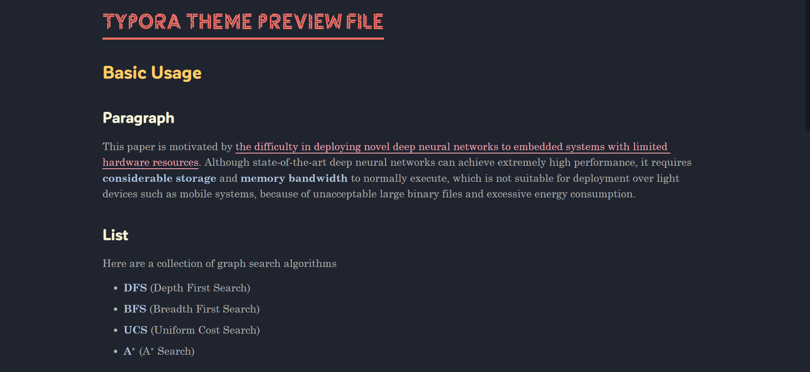
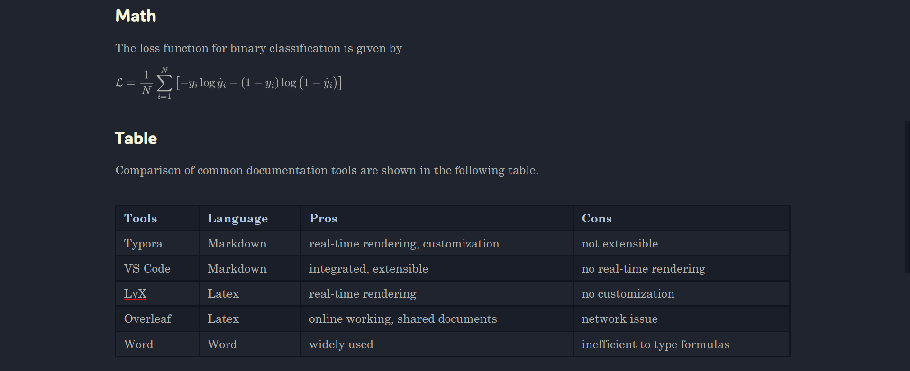
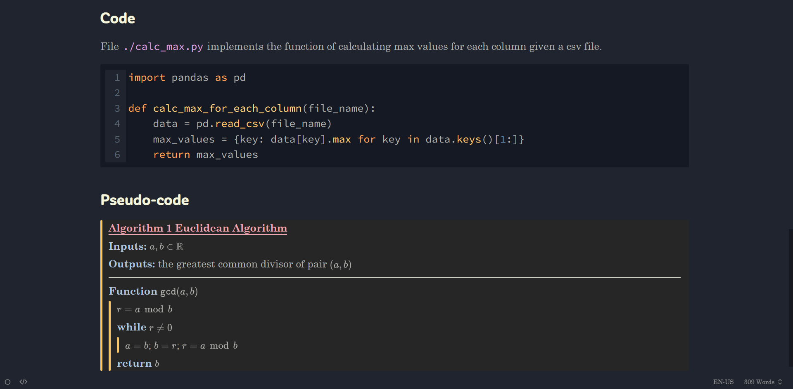

# Typora Theme — Drake AYU UPG

## Declarations

<u>ONCE USING, DISTRIBUTING OR DEVELOPING THIS PROJECT, IN ANY SENSE THROUGH ANY MEDIA, YOU HAVE CAREFULLY READ, EXPLICITLY UNDERSTOOD, AND FAITHFULLY ENDORSED THE DECLARATIONS. THEREFORE, THE OWNERS OF THIS PROJECT ARE NOT RESPONSIBLE FOR ANY OTHERS’ AGGRESSIVE ABUSE, UNEXPECTED VIOLATIONS OR ILLEGAL APPLICATIONS. ACCUSATIONS TO THE OWNERS ARE DENIED UNLESS THE CORRELATED REGULATIONS ARE PROBLEMATIC UNDER CONVINCING EVIDENCES.</u>

- This project **does not contain** any (potentially) illegal contents. This project **does not infringe** any intellectual property. This project **does not violate** any privacy policy.
- You are **totally FREE** to use this theme for **personal usage**.
- You should **follow the license requirement** to develop and/or distribute this project.
- The rendered files using this theme **are PROHIBITED from any commercial usage**, including but not limited to **publishing, wide-spreading, advertising…** unless you have
    - Either **replaced** the fonts not free for commercial with fonts free for commercial.
    - Or **paid** those fonts licenses through official websites.

## Information

This project is a revised [Typora](https://typoraio.cn/) theme from [Drake Ayu](https://github.com/liangjingkanji/DrakeTyporaTheme) to support better display of documentation. It features multiple fonts and colorful visualization. The major revisions will be discussed in [Contents](#Contents) section.

Here provides some previews of this theme. You can also check the detailed examples in `example/`.

## Deployment

### Direct installation

Before deployment, the following requirements should be installed in advance.

- [Typora](https://typoraio.cn/)
- Fonts (For changing fonts, see [User definition](#User definition))
    - Century Schoolbook, Potra, Roboto Light, Source Code Pro, YEFONTYanShanTinXinKai
    - You can download those fonts from [here](https://www.fonts.net.cn/).

The following steps give an easy tutorial of installing this theme.

- Open the theme folder of your Typora by click `File` $\rightarrow$ `Preferences` $\rightarrow$ `Appearance` $\rightarrow$ `Open Theme Folder`.
- Copy the file `drake_ayu_upg.css` and `drake_google_upg.css`, and the whole folder `drake/` to the theme folder.
- Reopen your Typora, and change your theme by click `Themes` $\rightarrow$ `Drake Ayu Upg`.

Then the theme is expected to be installed and used in Typora. You can also check the final performance with the help of example files provided in this project.

### Export settings

However, for convenience over exporting files, the following procedures are recommended to proceed.

- Open the export settings by click `File` $\rightarrow$ `Preferences` $\rightarrow$ `Export`.
- For both `PDF` and `HTML` pages, change the default `Theme` to `Drake Google Upg`.

This will enforce the Typora to use Drake Google Upg for exporting files, instead of the default light theme.

### User definition

#### font changing

The following steps give an easy tutorial of changing fonts (almost globally) for this theme

1. Have your target fonts installed.
2. Open the theme folder of your Typora.
3. Open `drake/font.css`.
4. Write your target font before all the default values (or you can simply replace the first one) for each category.

#### Customization

You can customize your theme further by modifying the style file `drake_ayu.css` and `drake_google.css` directly.

## Usage

There are two themes provided in this project, but only one of them, Drake Ayu Upg, is designed for usage. The other theme, Drake Google Upg, exists because Typora does not support exporting files under dark themes. The latter one is the theme applied to generate pdf documents. If you want to export your file in a white theme under a very similar format, please make sure that you have proceed these [procedures](#Export settings).

From the owners’ experience, two exporting techniques are frequently used.

- Export to pdf file directly.
- Export to html with style. Then use browser to transform html to pdf file.

Take a look at the whole document and make sure no unexpected formatting problem occurs.

## Contents

This section lists all the modifications of Drake Ayu Upg. The other theme is just an attached version.

1. Font family changes
    - Title font — the H1 header font is changed to Potra.
    - Header font — the H2 to H6 header font and the sidebar font are changed to Roboto Light.
    - Text font — the main font is changed to Century Schoolbook.
    - Code font — the inline code font and block code font are changed to Source Code Pro.
2. Font size changes
    - the font size for H1 to H6 is set to a bigger value for fitting the new font families.
    - the font size for mathjax is slightly reduced for fitting the main text.
3. Font color changes
    - Title and header — the H1 header is set to red, the H2 header is set to light orange, and the H3 header is set to light gray.
    - Marks — the emphasis words (italic) is set to pink, and the strong words (bold) is set to light sky blue.
    - Inline code — the inline code is set to light purple.
4. Header style changes
    - Title — the H1 header is adjusted to left-aligned with underline. 
    - Header — the H2 header is adjusted to style without underline.
5. Blockquote style changes
    - The style of blockquote is revised for writing pseudo-code in a compact form.
    - The space between each line is reduced.
    - The space around blockquote embedding is reduced.

With the help of the above changes, this theme is able to achieve

- layered organization of the full documents
- more comfortable reading experience
- better visualization for paragraphs with suitable marks
- a light support for writing pseudo-code 

## License

This project follows <u>Apache License 2.0</u>, inherited by the original [Drake](https://github.com/liangjingkanji/DrakeTyporaTheme).

All the fonts mentioned and selected in this project are <u>free for personal use</u>. However, most of them are **not** free for commercial use.
